# Summary of 3_Linear

[<< Go back](../README.md)

## Logistic Regression (Linear)
- **n_jobs**: -1
- **explain_level**: 2

## Validation
 - **validation_type**: split
 - **train_ratio**: 0.75
 - **shuffle**: True
 - **stratify**: True

## Optimized metric
logloss

## Training time

2.6 seconds

## Metric details
|           |    score |   threshold |
|:----------|---------:|------------:|
| logloss   | 0.399134 |  nan        |
| auc       | 1        |  nan        |
| f1        | 1        |    0.277354 |
| accuracy  | 1        |    0.277354 |
| precision | 1        |    0.277354 |
| recall    | 1        |    0.105014 |
| mcc       | 1        |    0.277354 |

## Confusion matrix (at threshold=0.277354)
|              |   Predicted as 0 |   Predicted as 1 |
|:-------------|-----------------:|-----------------:|
| Labeled as 0 |                5 |                0 |
| Labeled as 1 |                0 |                5 |

## Learning curves
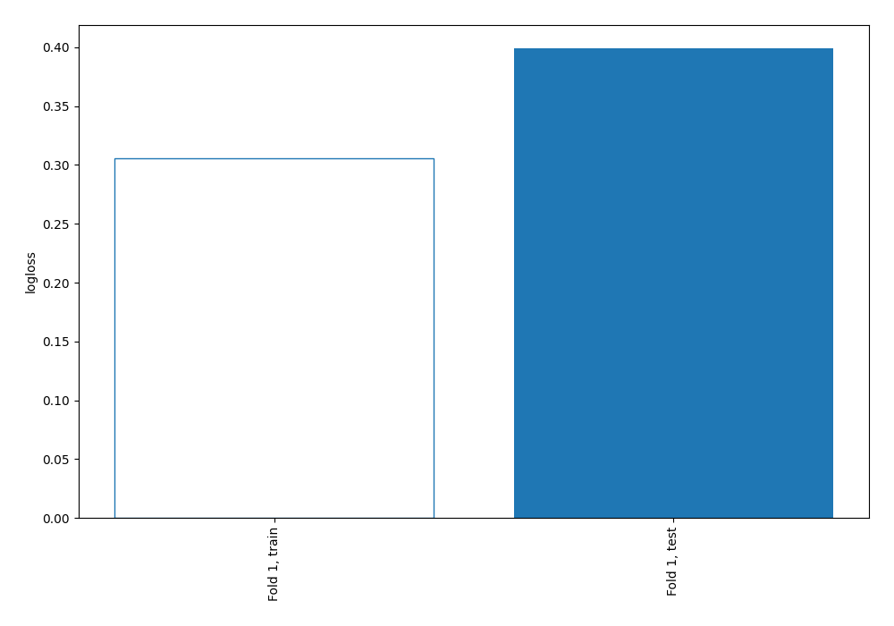

## Coefficients
| feature   |   Learner_1 |
|:----------|------------:|
| Name      |   0.746886  |
| SibSp     |   0.605622  |
| Parch     |   0.53489   |
| Embarked  |   0.101779  |
| Fare      |  -0.0967966 |
| intercept |  -0.406815  |
| Pclass    |  -0.591815  |
| Ticket    |  -0.687212  |
| Age       |  -0.877844  |
| Sex       |  -1.57272   |

## Permutation-based Importance
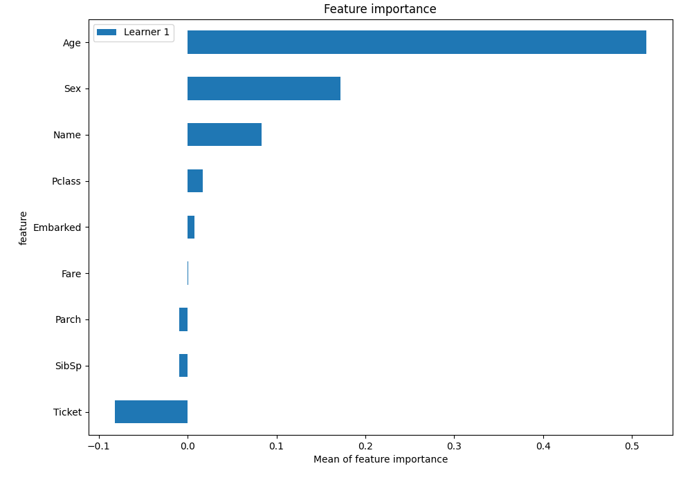
## Confusion Matrix

## Normalized Confusion Matrix

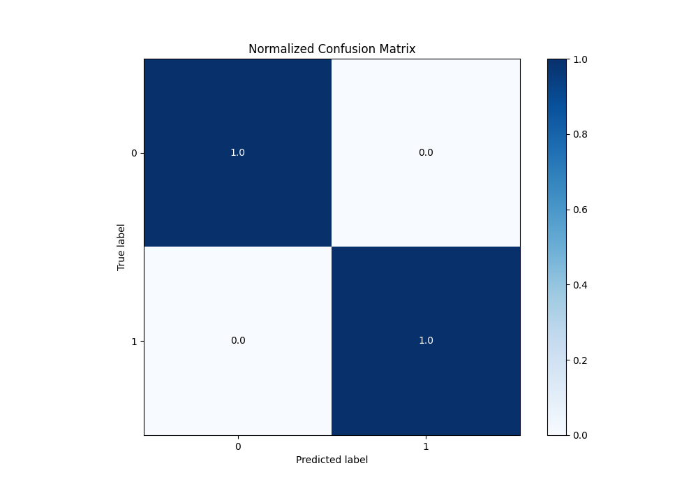

## ROC Curve

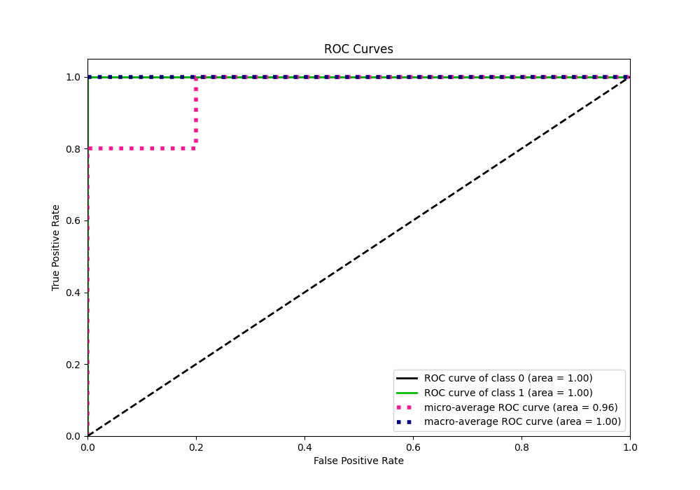

## Kolmogorov-Smirnov Statistic

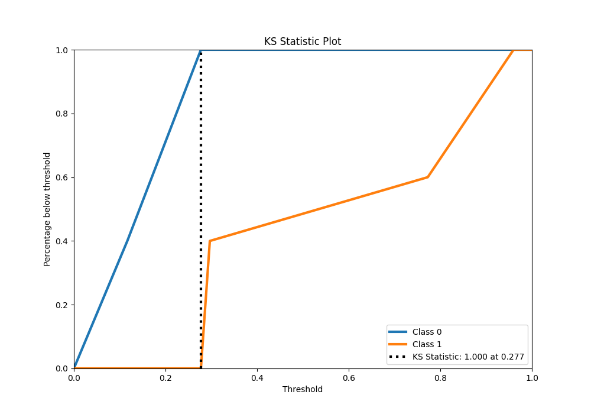

## Precision-Recall Curve

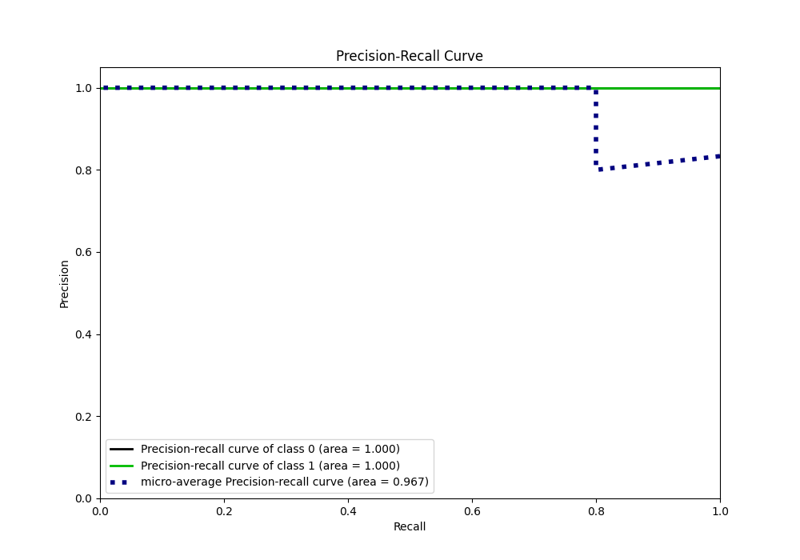

## Calibration Curve

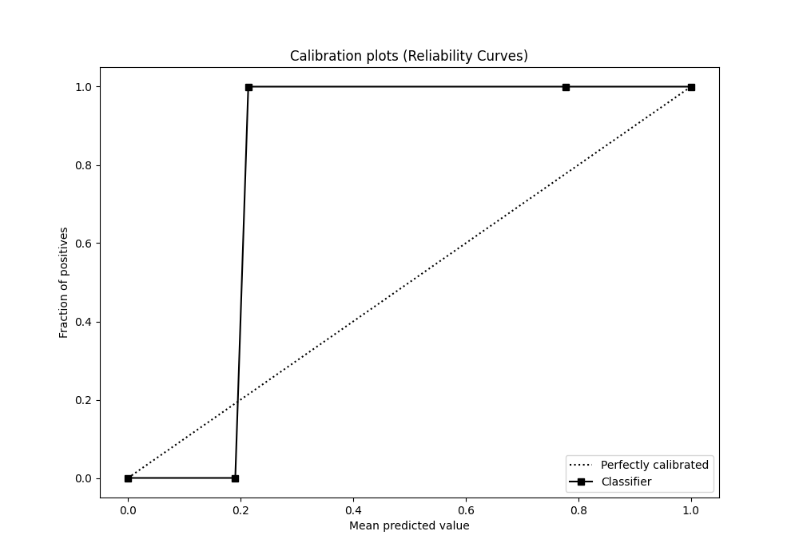

## Cumulative Gains Curve

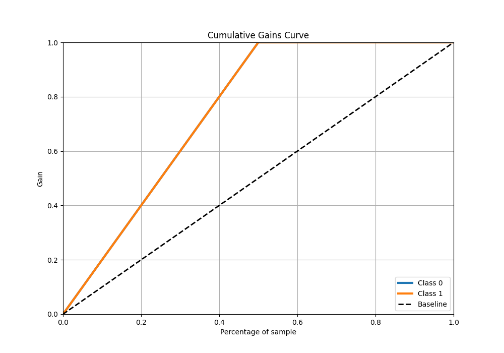

## Lift Curve

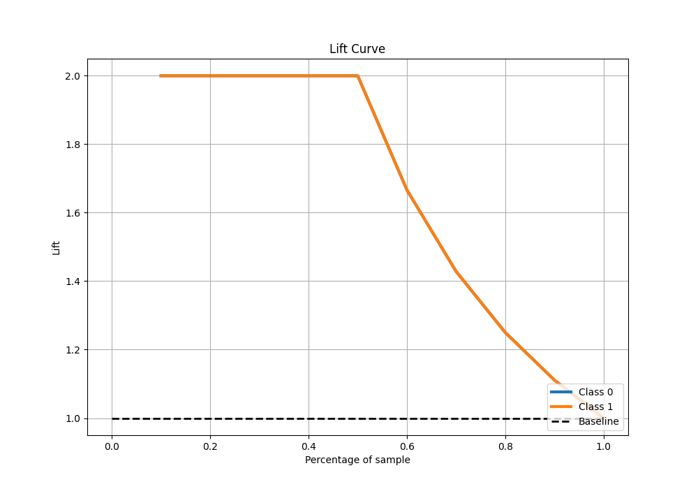

## SHAP Importance
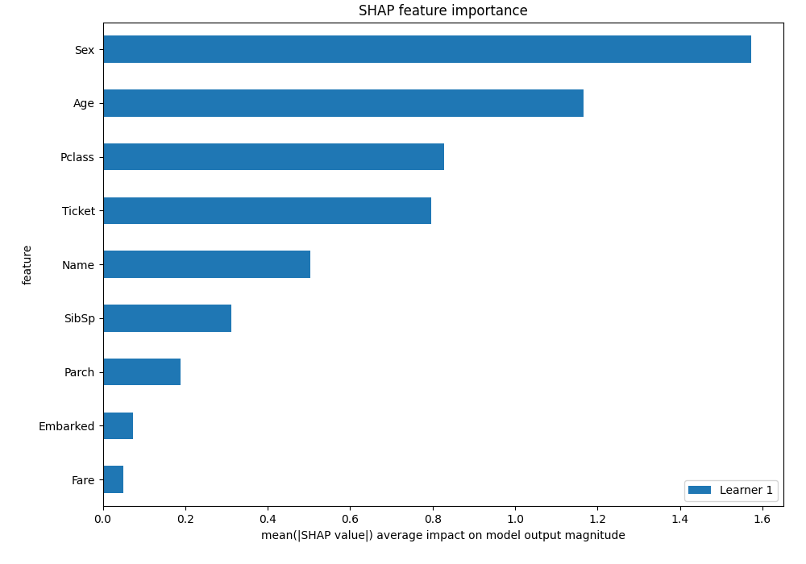

## SHAP Dependence plots

### Dependence (Fold 1)
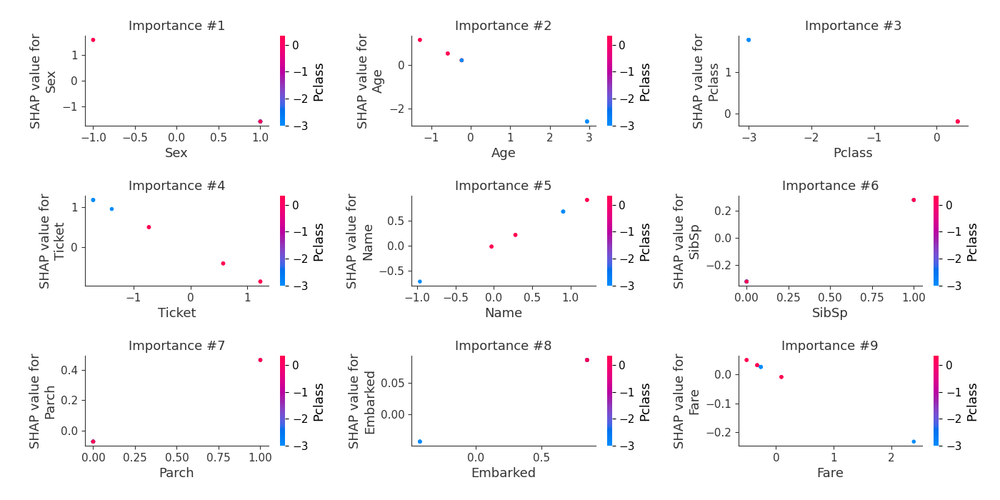

## SHAP Decision plots

### Top-10 Worst decisions for class 0 (Fold 1)
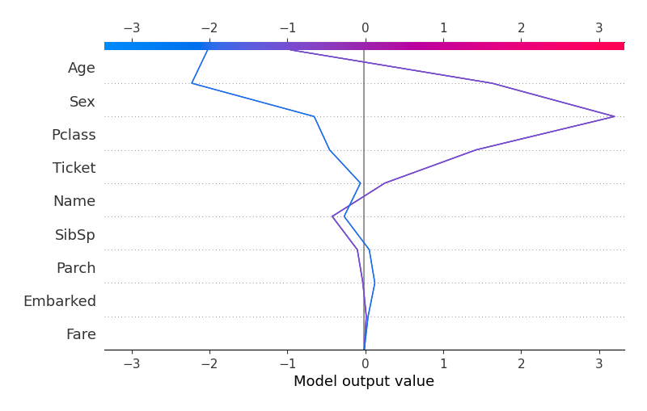
### Top-10 Best decisions for class 0 (Fold 1)

### Top-10 Worst decisions for class 1 (Fold 1)

### Top-10 Best decisions for class 1 (Fold 1)
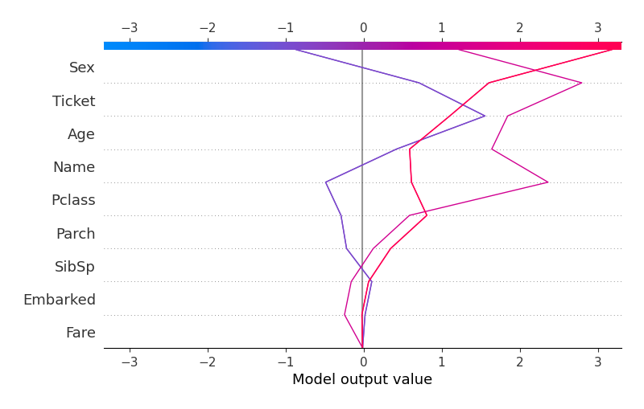

[<< Go back](../README.md)
