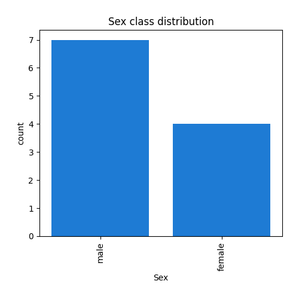

# Exploratory Data Analysis

[<< Go back](../README.md)
## Feature : target
- **Feature type** : discrete
- **Missing** : 0.0%
- **Unique** : 2
- **Count** :11.0
- **Mean** :0.45454545454545453
- **Std** :0.5222329678670934
- **Min** :0.0
- **25%th Percentile** : 0.0
- **50%th Percentile** : 0.0
- **75%th Percentile** : 1.0
- **Max** :1.0

## Feature : Pclass
- **Feature type** : discrete
- **Missing** : 0.0%
- **Unique** : 2
- **Count** :11.0
- **Mean** :2.8181818181818183
- **Std** :0.4045199174779452
- **Min** :2.0
- **25%th Percentile** : 3.0
- **50%th Percentile** : 3.0
- **75%th Percentile** : 3.0
- **Max** :3.0

## Feature : Name
- **Feature type** : categorical
- **Missing** : 0.0%
- **Unique** : 11
- **Count** :11
- **Unique** :11
- **Top** :Kelly, Mr. James
- **Freq** :1

## Feature : Sex
- **Feature type** : categorical
- **Missing** : 0.0%
- **Unique** : 2
- **Count** :11
- **Unique** :2
- **Top** :male
- **Freq** :7

## Feature : Age
- **Feature type** : continous
- **Missing** : 9.090909090909092%
- **Unique** : 10
- **Count** :10.0
- **Mean** :30.15
- **Std** :14.541224921657122
- **Min** :14.0
- **25%th Percentile** : 21.25
- **50%th Percentile** : 26.5
- **75%th Percentile** : 33.375
- **Max** :62.0

## Feature : SibSp
- **Feature type** : discrete
- **Missing** : 0.0%
- **Unique** : 3
- **Count** :11.0
- **Mean** :0.45454545454545453
- **Std** :0.6875516509523286
- **Min** :0.0
- **25%th Percentile** : 0.0
- **50%th Percentile** : 0.0
- **75%th Percentile** : 1.0
- **Max** :2.0

## Feature : Parch
- **Feature type** : discrete
- **Missing** : 0.0%
- **Unique** : 2
- **Count** :11.0
- **Mean** :0.18181818181818182
- **Std** :0.4045199174779452
- **Min** :0.0
- **25%th Percentile** : 0.0
- **50%th Percentile** : 0.0
- **75%th Percentile** : 0.0
- **Max** :1.0

## Feature : Ticket
- **Feature type** : categorical
- **Missing** : 0.0%
- **Unique** : 11
- **Count** :11
- **Unique** :11
- **Top** :330911
- **Freq** :1

## Feature : Fare
- **Feature type** : continous
- **Missing** : 0.0%
- **Unique** : 11
- **Count** :11.0
- **Mean** :11.872354545454545
- **Std** :7.49544910146999
- **Min** :7.0
- **25%th Percentile** : 7.7292000000000005
- **50%th Percentile** : 8.6625
- **75%th Percentile** : 10.9875
- **Max** :29.0

## Feature : Cabin
- **Feature type** : continous
- **Missing** : 100.0%
- **Unique** : 0
- **Count** :0.0
- **Mean** :nan
- **Std** :nan
- **Min** :nan
- **25%th Percentile** : nan
- **50%th Percentile** : nan
- **75%th Percentile** : nan
- **Max** :nan

## Feature : Embarked
- **Feature type** : categorical
- **Missing** : 0.0%
- **Unique** : 3
- **Count** :11
- **Unique** :3
- **Top** :S
- **Freq** :7

[<< Go back](../README.md)
