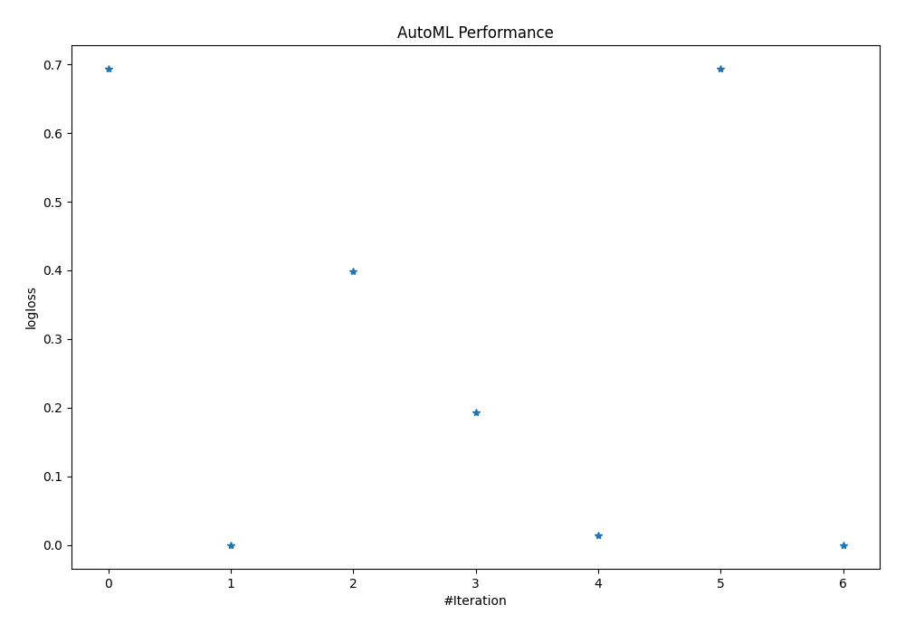
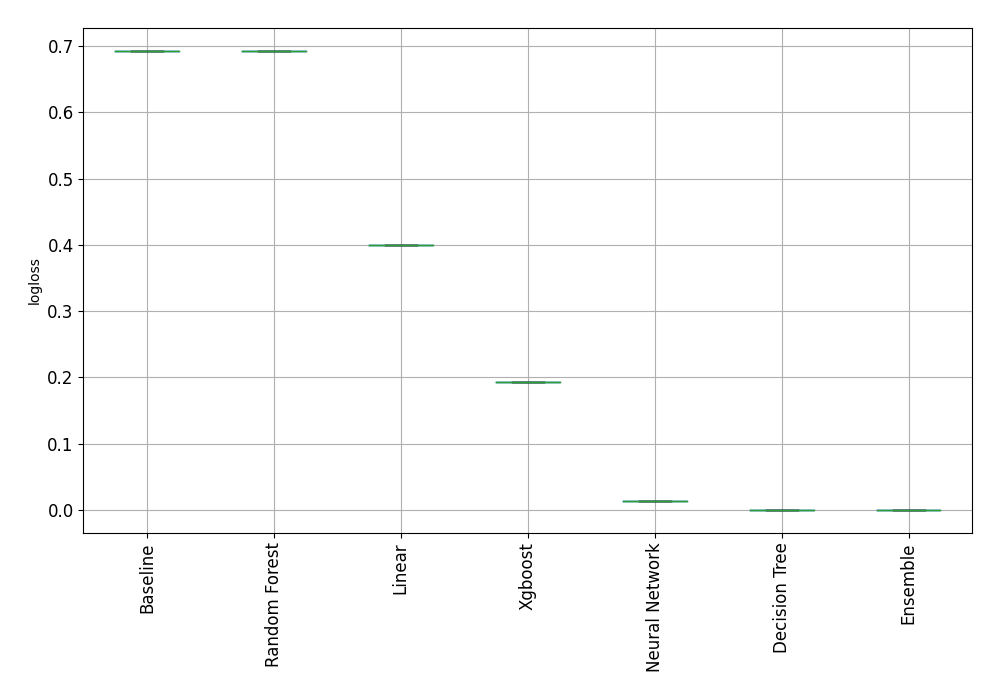
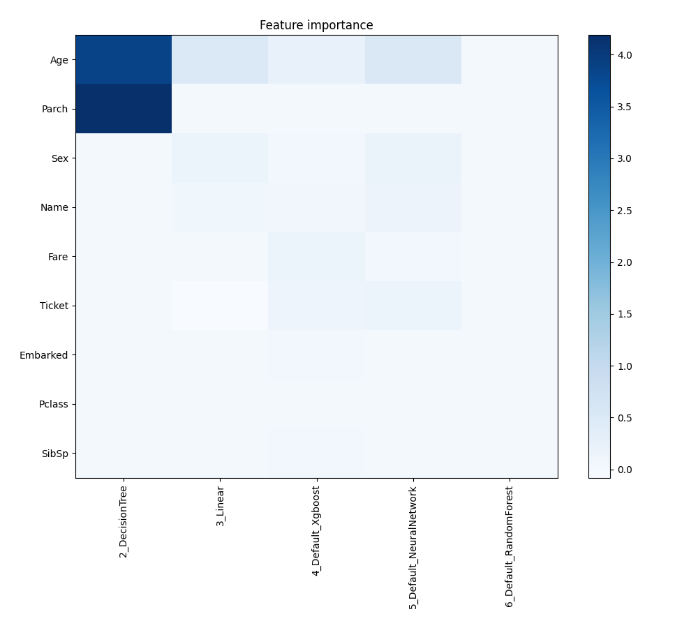
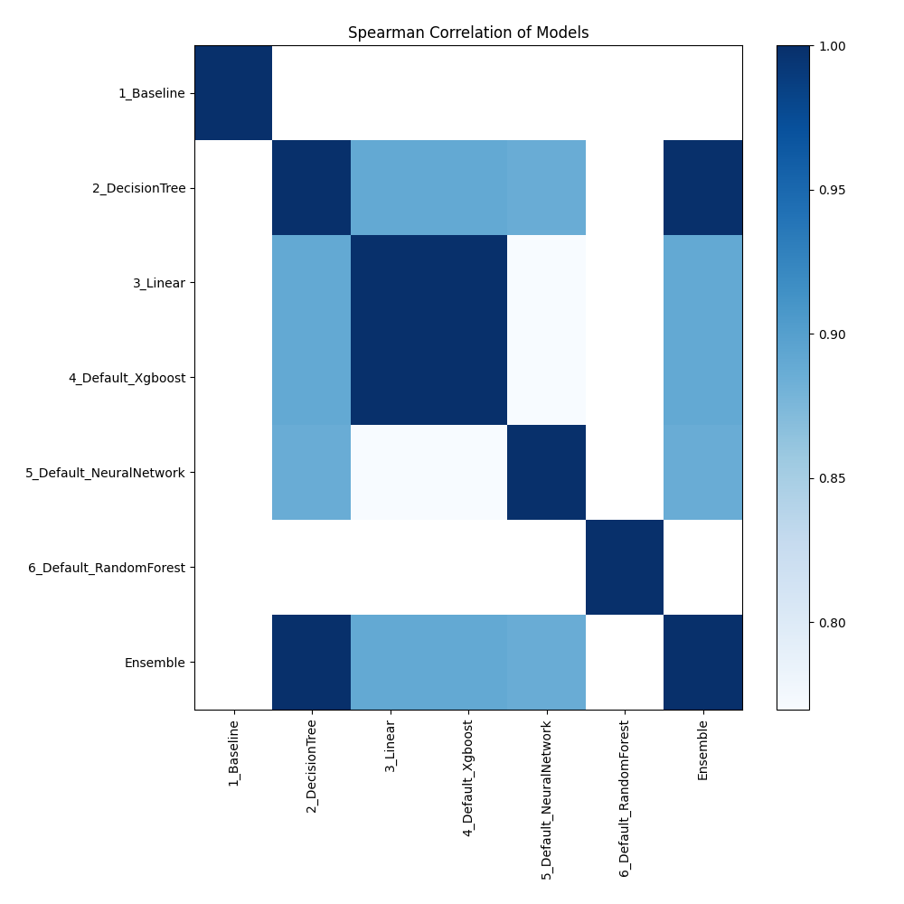

# AutoML Leaderboard

| Best model   | name                                                         | model_type     | metric_type   |   metric_value |   train_time |
|:-------------|:-------------------------------------------------------------|:---------------|:--------------|---------------:|-------------:|
|              | [1_Baseline](1_Baseline/README.md)                           | Baseline       | logloss       |      0.693147  |         1.42 |
| **the best** | [2_DecisionTree](2_DecisionTree/README.md)                   | Decision Tree  | logloss       |      1e-06     |         5.06 |
|              | [3_Linear](3_Linear/README.md)                               | Linear         | logloss       |      0.399134  |         3.81 |
|              | [4_Default_Xgboost](4_Default_Xgboost/README.md)             | Xgboost        | logloss       |      0.193287  |         2.47 |
|              | [5_Default_NeuralNetwork](5_Default_NeuralNetwork/README.md) | Neural Network | logloss       |      0.0135743 |         1.79 |
|              | [6_Default_RandomForest](6_Default_RandomForest/README.md)   | Random Forest  | logloss       |      0.693147  |         5.32 |
|              | [Ensemble](Ensemble/README.md)                               | Ensemble       | logloss       |      1e-06     |         0.46 |

### AutoML Performance

### AutoML Performance Boxplot

### Features Importance

### Spearman Correlation of Models

